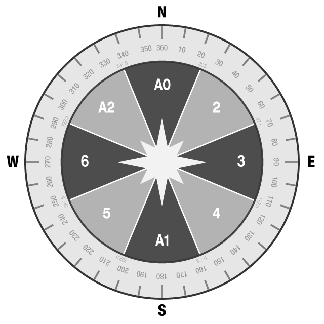

# Warm n Fuzzies

Warm and Fuzzies is an (unnecessary) wearable which **heats up in the direction of your heart's desire** - Home, Friend, Mecca / The Wailing Wall, or the nearest Starbucks.

 

It uses Particle's dev kit, currently set up for the [Particle Photon](https://store.particle.io/collections/photon), the WiFi version. 

#### Status

This project is still in Beta and I will update this page as we go along.
If you have any questions about the code or the componenets, email me at noam@cca.edu.

An [Electron](https://store.particle.io/collections/electron) version coming soon. 

## Components
* Particle Photon
* **A GPS Breakout** - [Adafruit Ultimate GPS V3](https://www.adafruit.com/product/746)
* **A Compass Breakout** - [LSM303DLHC](https://www.adafruit.com/product/1120)
* **Heating Pads** - I'm using [Adafruit's](https://www.adafruit.com/product/1481)
* An **External Active GPS Antenna** (and the correct connectors + adaptors for it) - you can buy Adafruit's or find something on eBay / Amazon
* A **power source for the Photon** - either a 3.7v Lipo Battery, or a regular 5V USB Bank. 
* A **7-12V High Capacity, High Drain battery pack** – to run the heating circuits (not a regular 9V) - See [Powering this Project] below.

  You can swap some of these components with others, but it might require a library or code tweak.
  You can also make your own heating pads or swap the output with something like LEDs or Vibration motors.

## Schematic

 

## Powering this Project
  You'll need at least 7000mAh to get the heating pads to really heat up. The heating pad I'm using are about 11cm in width. Check out the data sheet with the V/Ah tables [here](https://cdn-shop.adafruit.com/datasheets/Ultra+Heating+Fabric.pdf).
  
  To get the Voltage and Amperage needed, I recommend using something like [this](http://a.co/99Ji5B1) or A couple of these [18650 Batteries](http://a.co/b3cm1pK)

  :boom::boom::boom:  **Make sure you buy 18650 batteries with circuit protection! If they don't say they have it, they don't.  
  Unprotected batteries of that sort have the potential to burst into fire or explode!**

## Setup
These instructions assume you have a basic knowledge of soldering, programming and a familiarity with the Particle IDE environment. If you're just beginning with Particle, I recommend you check out the [Getting Started guide](https://docs.particle.io/guide/getting-started/start/photon/), and build a few basic circuit first.
If you run into any issue or any question - feel free to email me at noam@cca.edu. 

### Create the circuit
Either on a breadboard, or on a protoboard. If you're brave - sew the components onto a piece of fabric using conductive thread.
### Power the Particle
Make sure the particle device is powered separately (using the USB connector or the vin pin) than the heat pads. The Heatpads need to be powered by the big power supply, but the Particle can only take 5V through the USB, or 3.3v through the VIN pin. 
Their GNDs need to be connected for switching the heatapd MOSFETs on and off. 
### Upload the code
Either use the Particle Dev IDE with the entire file set from this github repository, or copy the contents of [src/warm.ino] to the [particle online IDE](https://build.particle.io/), and import the libraries specified below under [libraries](#libraries).

## Operation
The project is meant to be worn. Attach the heating pads to the inside of a shirt, a vest or a jacket, and wire them to the circuit so the pins align to the diagram below

The diagram shows the allotment of bearing angles to heating pads. The Cardinal Directions (N/E/S/W) are not true magnetic directions, but based on the direction of the individual. "North" is pointing to the front. 
<a href="https://raw.githubusercontent.com/zomerfeld/warm_n_fuzzies/master/compass_nums2.png" target="blank">Open in a new tab</a>
 

Set up a destination using the Particle Function *SetTarget* on the [Particle Dashboard](https://console.particle.io/devices), under the device you uploaded the code to. 

## Code Walkthrough
### Libraries
I have created this project using the Particle Web IDE and these libraries. They should all be added automatically with the 'project.properties' file, but in case this fails, you will need to add these libraries to your code, using the libraries tab. 
* Adafruit_Sensor (1.0.2)
* [Particle-GPS](https://github.com/porrey/Particle-GPS) (1.0.4) by Daniel Porrey
* [Adafruit_LSM303_U](https://github.com/zomerfeld/Adafruit_LSM303_U) (1.0.8) by Adafruit's Kevin Townsend (ported by yours truly)  
 

* Important Functions

## Heating Circuit Tutorial

<a href="https://raw.githubusercontent.com/zomerfeld/warm_n_fuzzies/master/MyCircuit_HeatingPad.png" target="blank">Open in a new tab</a>

 

## Caveats and Important notes
* Compass orientation
* Compass Math and Such - if you can fix it let me know 
* GPS Antenna is necessary 

### Dashboard

#### IFTTT Integration

